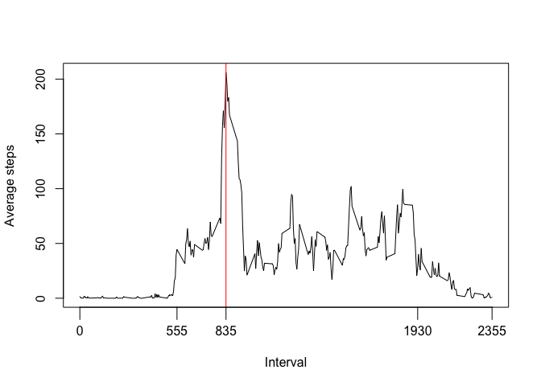
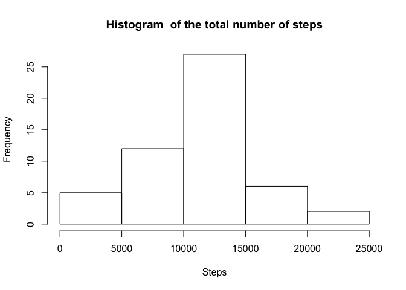
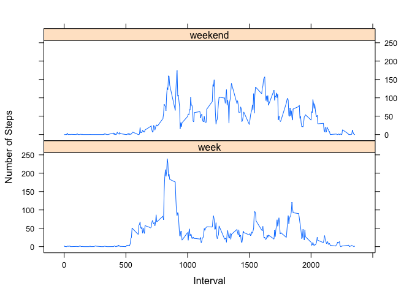

# Reproducible Research: Peer Assessment 1


## Loading and preprocessing the data

 * Libraries used

```r
library(ggplot2)
library(plyr)
library(dplyr)
library(lattice)
```

 * Code for reading in the dataset and/or processing the data

```r
unzip("activity.zip")
activity <- read.csv("activity.csv")
```

 * Histogram of the total number of steps taken each day


```r
sumActivity<-aggregate(activity$steps, by=list(date=activity$date), FUN=sum)

hist(sumActivity$x, main="Histogram  of the total number of steps", 
     xlab="Steps")
```

<!-- -->

## What is mean total number of steps taken per day?

```r
mean(sumActivity$x, trim = 0, na.rm = TRUE)
```

```
## [1] 10766.19
```

```r
median(sumActivity$x, na.rm = TRUE)
```

```
## [1] 10765
```

## What is the average daily activity pattern?

Calculate the average activity pattern and the maximum value.

```r
avgActivity<-aggregate(activity$steps, by=list(interval=activity$interval), FUN=mean, na.rm=TRUE)
max(avgActivity$x)
```

```
## [1] 206.1698
```

```r
maxAvgActivity<-avgActivity[which.max(avgActivity$x),]
maxAvgActivity
```

```
##     interval        x
## 104      835 206.1698
```
Print the average activity pattern and the maximum value. The maximul value is highlighted.

```r
g <- plot(avgActivity$interval, avgActivity$x, type="l", ylab="Average steps", xlab="Interval", xaxt="n")
abline(v=maxAvgActivity$interval, col="red")
axis(1, at=c(0, 555, maxAvgActivity$interval, 1930, max(avgActivity$interval)),
     col=c("black", "black", "red","black","black"),tck=-.05)
```

<!-- -->

## Imputing missing values

* Number of NA values:


```r
sum(is.na(activity$steps))
```

```
## [1] 2304
```

* Fill NA with median value per day

```r
impute.mean <- function(x) replace(x, is.na(x), mean(x, trim = 0, na.rm = TRUE))
activityFixed <- activity %>%
    group_by(date) %>%
    mutate(
        steps = impute.mean(steps)
    );
sum(is.na(activityFixed$steps))
```

```
## [1] 2592
```
 
 * Make a histogram of the total number of steps taken each day and Calculate and report the mean and median total number of steps taken per day. Do these values differ from the estimates from the first part of the assignment? What is the impact of imputing missing data on the estimates of the total daily number of steps?


```r
sumActivityFilled<-aggregate(activityFixed$steps,by=list(date=activityFixed$date), FUN=sum)

hist(sumActivityFilled$x, main="Histogram  of the total number of steps", 
     xlab="Steps")
```

<!-- -->

```r
mean(sumActivityFilled$x, trim = 0, na.rm = TRUE)
```

```
## [1] 10754.92
```

```r
median(sumActivityFilled$x, na.rm = TRUE)
```

```
## [1] 10682.5
```
## Are there differences in activity patterns between weekdays and weekends?

 * Create a new factor variable in the dataset with two levels – “weekday” and “weekend” indicating whether a given date is a weekday or weekend day.
 

```r
 activityFixed$day <- ifelse(weekdays(as.Date( activityFixed$date)) != 'Saturday', ifelse(weekdays(as.Date( activityFixed$date)) != 'Sunday', 'week','weekend'), 'weekend')
 weekendFactor = factor(activityFixed, levels=c("week", "weekend"))
```
 * Make a panel plot containing a time series plot (i.e. 𝚝𝚢𝚙𝚎 = "𝚕") of the 5-minute interval (x-axis) and the average number of steps taken, averaged across all weekday days or weekend days (y-axis). See the README file in the GitHub repository to see an example of what this plot should look like using simulated data.


```r
avgActivityFixed<-aggregate(activityFixed$steps, by=list(day=activityFixed$day,interval=activityFixed$interval), FUN=mean, na.rm=TRUE)
 
xyplot(x~interval | day, data = avgActivityFixed,
      type = 'l',
      xlab = 'Interval',
      ylab = 'Number of Steps',
      layout = c(1,2))
```

<!-- -->
